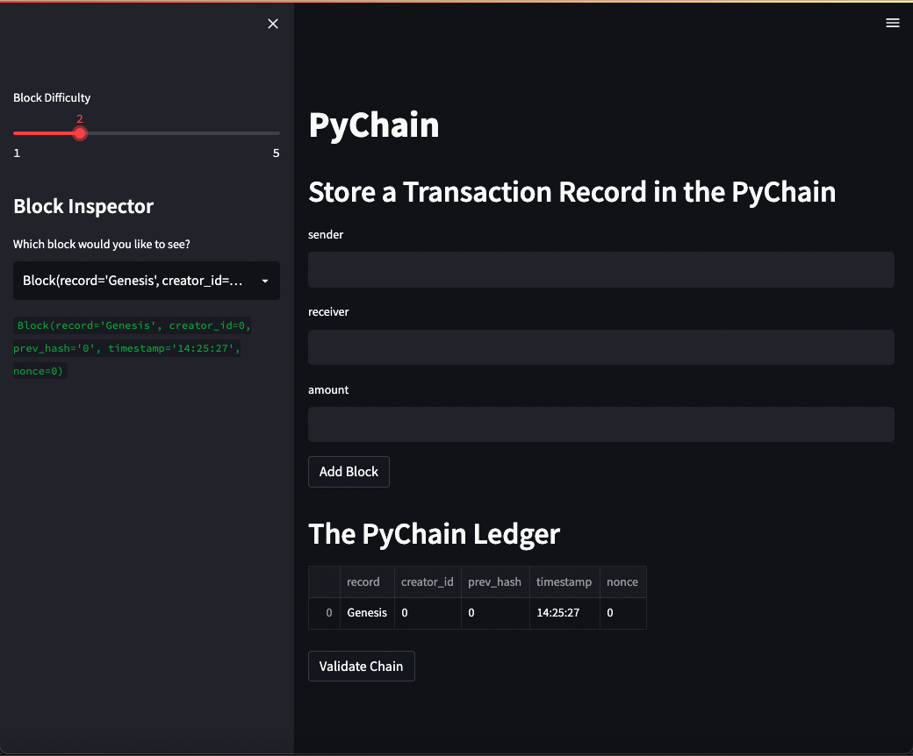
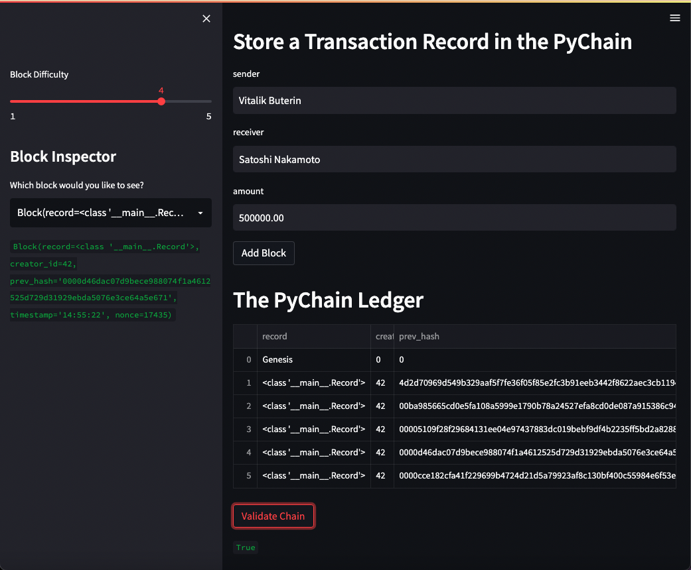

# GENESYS
GENESYS is a blockchain-based ledger system with a user-friendly web interface that allows peer to peer financial transactions (that is, to transfer money between senders and receivers) and to verify the integrity of the data in the ledger.

---

## Requirements
This application was writen in Python 3.9.7

Operating System:

* Window 10 (or higher) using Gitbash.
* MacOS 10.14 (or higher) using a terminal.
* Linux Ubuntu 22.04 (or higher) using a terminal.

Will need to be installed:

streamlit 1.11.0
```
pip install streamlit
```
---

## Installation
To install the application you will need to clone the GitHub repository.

```
$ git clone https://github.com/yanickw/genesys
```

---
## Get Started

Running the app
```
$ streamlit run pychain.py
```

Once it opens in your browser you will see the app.



Genesys is a gateway to store transaction information within a decentralized blockchain.

### *INPUT*
The app allows to set a the **block difficulty**, add a **sender**, a **receiver** and a trasaction **amount**.

* Block Difficulty: 
* Sender:
* Receiver:
* Amount:

### *ADDING BLOCK*
Once the block difficulty is set and all the information is completed you can select the `Add Block` button and it will automaticaly add it the the PyChain ledger as a new block in the block chain with its unique hash.

### *BLOCK INSPECTOR*
The **Block Inspector** allows you to get the information about a specific block within the PyChain Ledger.

Just Select the block that you would like to get the information from the drop down menu located on the left side bar of the app and the requested information will update under the same menu.

### *VALIDATE CHAIN*

You can validate that the blockchain hasn't been compromised at any time using the `Validate Chain` button located at the bottom of the app. If after pressing the button it returns "True" your blockchain is accurate (as demonstrated in the following picture)



---

## NEXT STEP
Genesys is still considered in alpha phase.

The next step will consist in 

* Storing our PyChain blockchain in a decentralized storage solution (ie. Storj or other similar technology).
* Enhance the security of the blockchain.
* Esthetic improvement to the app UI interface.
* Add an option to link senders and reciever to their blockchain wallets.


---

## Contributors
This application originated from a Berkeley Bootcamp.

For any inquieries, feedbacks or comments about this project please email me at  [yanickw@gmail.com](mailto:yanickw@gmail.com)

I can also be reached on  [LinkedIn](https://www.linkedin.com/in/yanickwilisky/)  or  [Twitter](https://twitter.com/yanickwilisky).

---

## License

MIT License

Copyright (c) 2022 Yanick Wilisky

Permission is hereby granted, free of charge, to any person obtaining a copy of this software and associated documentation files (the "Software"), to deal in the Software without restriction, including without limitation the rights to use, copy, modify, merge, publish, distribute, sublicense, and/or sell copies of the Software, and to permit persons to whom the Software is furnished to do so, subject to the following conditions:

The above copyright notice and this permission notice shall be included in all copies or substantial portions of the Software.

THE SOFTWARE IS PROVIDED "AS IS", WITHOUT WARRANTY OF ANY KIND, EXPRESS OR IMPLIED, INCLUDING BUT NOT LIMITED TO THE WARRANTIES OF MERCHANTABILITY, FITNESS FOR A PARTICULAR PURPOSE AND NONINFRINGEMENT. IN NO EVENT SHALL THE AUTHORS OR COPYRIGHT HOLDERS BE LIABLE FOR ANY CLAIM, DAMAGES OR OTHER LIABILITY, WHETHER IN AN ACTION OF CONTRACT, TORT OR OTHERWISE, ARISING FROM, OUT OF OR IN CONNECTION WITH THE SOFTWARE OR THE USE OR OTHER DEALINGS IN THE SOFTWARE.